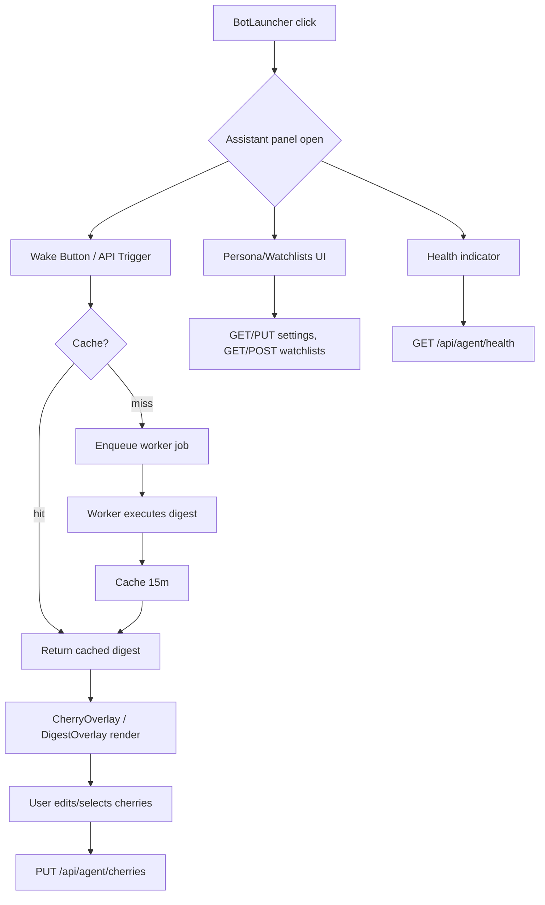

# Docked Assistant Lifecycle (Mermaid)

```mermaid
flowchart TD
  A[BotLauncher click] --> B{Assistant panel open}
  B --> C[Wake Button / API Trigger]
  C --> D{Cache?}
  D -- hit --> E[Return cached digest]
  D -- miss --> F[Enqueue worker job]
  F --> G[Worker executes digest]
  G --> H[Cache 15m]
  H --> E
  E --> I[CherryOverlay / DigestOverlay render]
  I --> J[User edits/selects cherries]
  J --> K[PUT /api/agent/cherries]
  B --> L[Persona/Watchlists UI]
  L --> M[GET/PUT settings, GET/POST watchlists]
  B --> N[Health indicator]
  N --> O[GET /api/agent/health]
```

